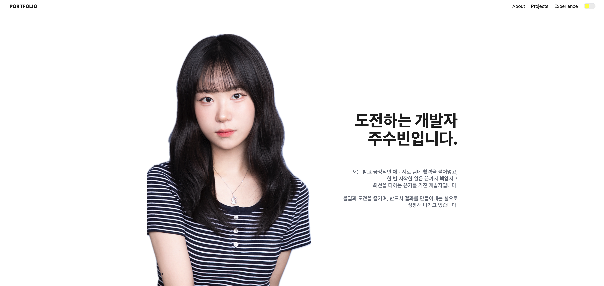
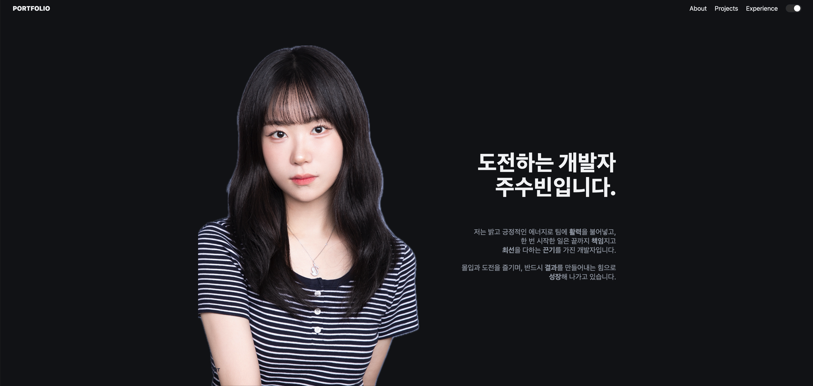
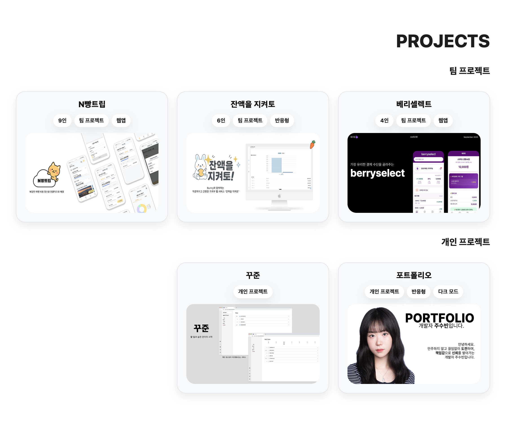
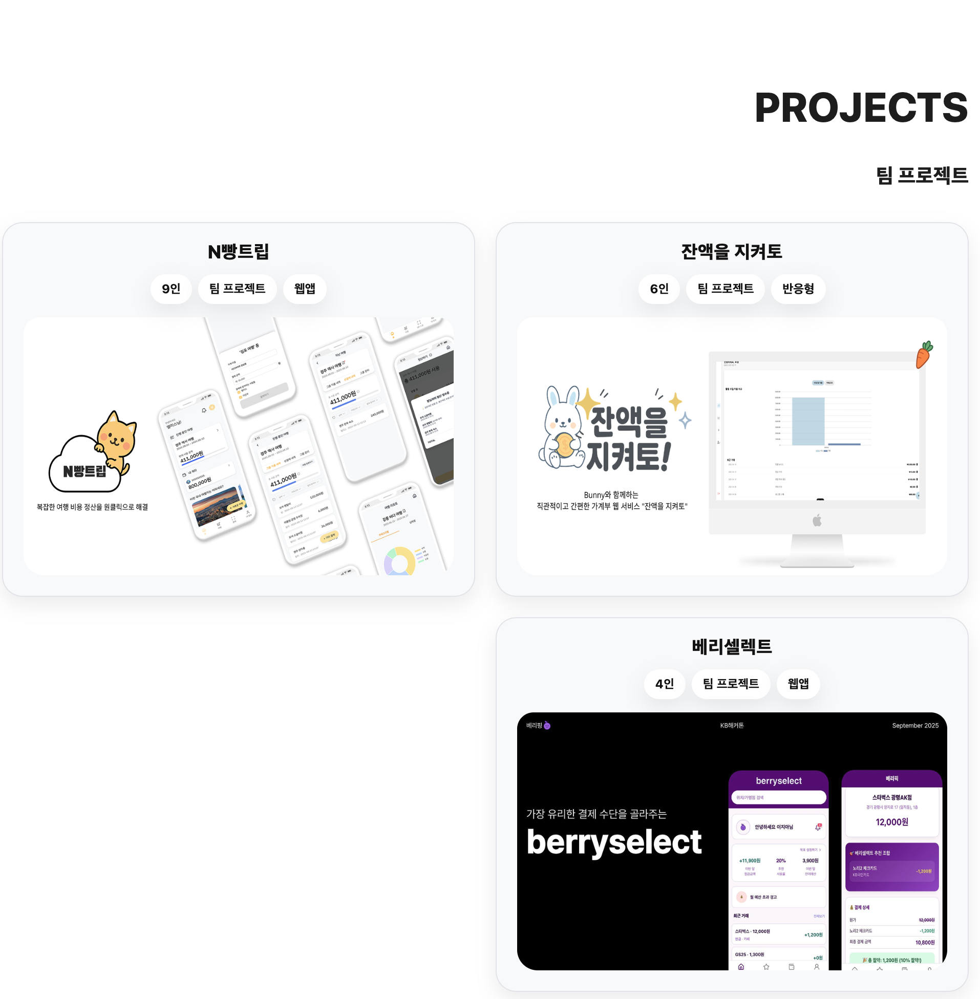
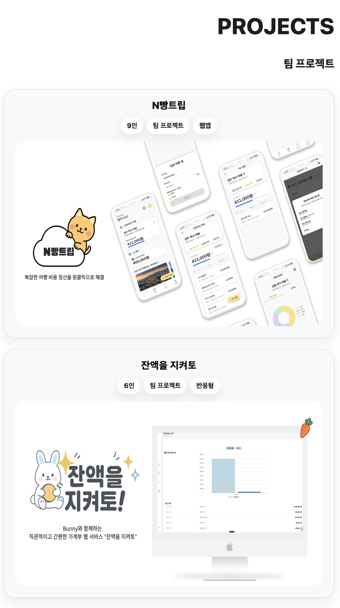

# 👩🏻‍💻 주수빈 포트폴리오

끊임없이 배우고 성장하는 개발자 **주수빈**입니다. 
프로젝트 경험과 기술 역량을 담아, 저의 가능성을 한 눈에 보실 수 있도록 정리했습니다.

---

## 🚀 배포 주소
> https://portfolio-sh7d-g64vkfgpk-subeens-projects-d258e35e.vercel.app/

---

## ✨ 주요 기능 (Features)

- **프로젝트 카드 & 상세페이지** : 프로젝트별 요약 및 기여도 정리

- **다크 모드 지원** : 사용자 맞춤 테마 전환 가능

   
  <em>라이트 모드 화면</em>

   
  <em>다크 모드 화면</em>

- **반응형 UI** : PC · 태블릿 · 모바일 대응

   
  <em>데스크톱 (1920×1080)</em>

   
  <em>태블릿 (834×1194)</em>

   
  <em>모바일 (390×844)</em>

- **빠른 로딩 속도** : Vite 기반 빌드와 코드 스플리팅 적용
- **SEO & OG 태그** : 검색엔진 최적화 + SNS 공유 미리보기 지원

---

## 🛠️ 기술 스택

### 💻 Stack

  
  
  
  

### ☁️ Infra & Deployment

  
  

### 🎨 Design & Collaboration

  
  

---

## 📮 연락처 (Contact)
- Email: sju081902@gmail.com
- GitHub: [subeen](https://github.com/subeen1902)
- Portfolio: [포트폴리오 사이트](https://portfolio-sh7d-g64vkfgpk-subeens-projects-d258e35e.vercel.app/)

---
